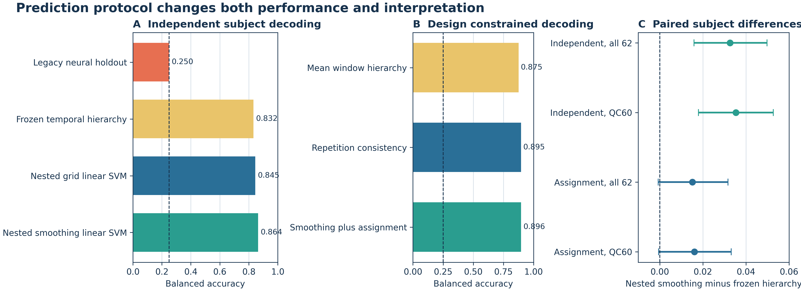

# Preprocessing Dominates Decoder Architecture in Subject Independent Motor Task fMRI

Working manuscript. Not submission ready until every item marked `PENDING` is resolved.

## Abstract

Subject independent decoding of task functional magnetic resonance imaging is vulnerable to optimistic validation and to preprocessing choices that silently use test set structure. We performed a leakage aware investigation of motor task decoding in the complete OpenNeuro `ds004044` cohort of 62 participants, 372 runs, and 2,976 four class movement events. Historical pooled and subject wise neural baselines remained near chance on the full cohort. In 30 repeated nested subject folds, a linear support vector machine using unlabeled target run centering and nested native Gaussian smoothing reached `0.8639` independent balanced accuracy. Its paired subject level gain over a previously frozen temporal hierarchy was `0.0326`, with a 95 percent bootstrap interval from `0.0159` to `0.0497`, while the hierarchy itself did not reliably exceed a preprocessing matched linear classifier. Enforcing the known complete run composition increased balanced accuracy to `0.8959`, but this was a design constrained transductive result rather than ordinary independent prediction. Twelve condition decoding reached `0.6838` against chance `0.0833`, indicating that the effect is not limited to a selected four class subset. `PENDING: exact pipeline permutation result and external HCP mechanism replication.` These findings identify target run adaptation and spatial scale, rather than decoder complexity, as the dominant determinants of transferable performance and provide explicit reporting rules for independent, transductive, and personalized motor task decoding.

Keywords: functional MRI; motor decoding; multivariate pattern analysis; preprocessing; subject generalization; transduction; reproducibility

## Highlights

* Full cohort neural baselines remain near chance under subject separation
* Nested native smoothing yields `0.8639` independent balanced accuracy
* Run adaptation and spatial scale dominate decoder architecture
* Design constrained assignment is reported separately from prediction
* Twelve motor conditions decode at more than eight times chance

## 1 Introduction

Motor task functional magnetic resonance imaging is an attractive setting for multivariate decoding because its cortical organization is structured, its event labels are experimentally controlled, and public cohorts support reproducible analysis. Yet high within cohort accuracy does not necessarily imply generalization to unseen participants. Random sample splits can leak participant identity, repeated events can expose run composition, and preprocessing performed on the complete dataset can transmit test information into training.

The initial version of this project used a hybrid three dimensional convolutional and Transformer model and reported high accuracy on a small subset. That result did not reproduce when the complete cohort and strict participant separation were used. Rather than hide the failure, we treated it as the starting point for a systematic investigation of timing, normalization, spatial resolution, smoothing, response reliability, acquisition quality, conventional multivariate classifiers, temporal hierarchies, and constrained decoding.

The investigation produced three questions. First, which operations create genuinely transferable signal across participants? Second, does a specialized decoder improve on a conventional linear model when preprocessing is matched? Third, how much apparent performance comes from independent prediction versus unlabeled test run adaptation or known run composition?

We answer these questions using repeated nested participant validation, paired participant inference, negative controls, and a full twelve condition analysis. The primary contribution is methodological: target run normalization and native spatial smoothing account for most of the recoverable performance, while decoder architecture contributes little after a fair comparison. We therefore advocate explicit separation of independent prediction, transductive preprocessing, design constrained assignment, and labeled personalization.

## 2 Methods

### 2.1 Dataset

The primary cohort is OpenNeuro `ds004044` version `2.0.3`. The verified analysis set contains 62 participants, six runs per participant, 372 runs, and 2,976 four class events. Each complete run contains two events from each of four movement classes: left leg, right leg, forearm, and upper arm. The full task contains twelve movement conditions and is analyzed separately to test whether conclusions from the four class subset generalize across the broader somatotopic design.

All 62 participants define the primary cohort. Participants `sub-42` and `sub-52` form a prespecified QC sensitivity analysis because independent acquisition and response audits identified unstable run level class topography. They are never removed from the primary estimate based on classifier error.

### 2.2 Event representation

Continuous event sequences were extracted using the frozen hemodynamic offset and length configuration. The four class artifact contains 48 events per participant, eight temporal samples per event, and 13,824 spatial features per sample. Artifact validation confirmed all subjects, labels, run records, tensor shapes, and hashes before modeling.

The primary conventional representation averages the frozen response window after target run preprocessing. Native Gaussian smoothing is applied before spatial resampling. Every operation that uses estimated parameters is fitted inside the relevant training partition.

### 2.3 Prediction protocols

Independent prediction assigns each event label from its feature vector without enforcing test class counts. This is the primary protocol.

Target run centering uses the unlabeled collection of events from a test run to remove its run mean. It is therefore described as test run adaptation rather than fully inductive preprocessing.

Balanced assignment uses the known fact that a complete run contains exactly two events per class. It selects the maximum score assignment satisfying that composition. This is a design constrained transductive protocol and is secondary.

Repetition consistency additionally uses paired repetition structure within a complete run. Labeled five run calibration uses target participant labels and is reported separately as personalization.

### 2.4 Validation and model selection

The internal confirmation uses 30 outer participant folds and four inner participant folds. No participant appears in both training and validation within any outer or inner split. Candidate preprocessing and classifier parameters are selected using inner independent balanced accuracy only. Outer results are pooled after all folds complete.

The primary classifier is a class balanced linear support vector machine. The final bounded preprocessing comparison includes native smoothing candidates on `24^3` and `32^3` grids and the unsmoothed `48^3` winner. No additional internal candidate may be added after the joint confirmation outcome is visible.

### 2.5 Comparators

Comparators include the historical pooled neural model, the historical subject wise neural holdout, a frozen mean window hierarchy, a nested temporal hierarchy, logistic regression, and preprocessing matched linear support vector machines. Comparisons between decoders use identical participant folds and representations whenever the scientific question concerns architecture.

### 2.6 Statistical analysis

The unit of paired inference is participant mean balanced accuracy across repeated held out appearances. Confidence intervals use 20,000 paired participant bootstrap draws with seed `20260824`. The primary result includes all 62 participants, with QC60 reported as sensitivity analysis.

`PENDING:` the final selected conventional pipeline will receive 200 within run label permutations. Each permutation must repeat inner preprocessing and classifier selection. The empirical one sided p value uses the standard plus one correction.

### 2.7 External mechanism replication

The HCP Young Adult 2025 motor task is prespecified as an external mechanism replication. Its genuine five classes are left finger, right finger, left toe, right toe, and tongue. It does not reproduce the original forearm and upper arm labels and will not be presented as exact label replication. Families remain inside a single fold, and only independent prediction is primary. The complete frozen protocol appears in `docs/HCP_EXTERNAL_REPLICATION_PROTOCOL.md`.

### 2.8 Ethics, data, and code

The study reuses public deidentified datasets under their respective data use terms. No new human participants were recruited. Public source code, lightweight result records, split definitions, and reproduction commands are maintained in the project repository. Raw HCP restricted family information will not be published.

## 3 Results

**Figure 1. Prediction protocol changes performance and interpretation.** Independent
subject decoding is separated from complete run design constrained decoding. Panel C
shows paired subject bootstrap intervals for nested native smoothing minus the frozen
temporal hierarchy. The independent intervals exclude zero, whereas the assignment
intervals do not.

### 3.1 Historical high accuracy does not reproduce on the full cohort

The full cohort pooled legacy model ended at accuracy `0.2629` and balanced accuracy `0.2648`. The legacy subject wise holdout produced accuracy and balanced accuracy `0.2500`. These negative controls establish that the original `0.8522` subset result is not evidence of full cohort participant generalization.

### 3.2 A frozen hierarchy recovers signal, but not architectural superiority

The frozen nested temporal hierarchy reached independent accuracy `0.8314`. The design constrained complete run decoder reached balanced accuracy `0.8948`, and the conservative mean window hierarchy reached `0.8752`.

When the linear support vector machine received the same smoothing used by the hierarchy, the hierarchy advantage fell to `0.0040`, with a 95 percent interval from `-0.0119` to `0.0198`. Decoder superiority therefore did not survive preprocessing matching.

### 3.3 Nested native smoothing improves independent decoding

Nested native Gaussian smoothing on the `24^3` representation reached independent balanced accuracy `0.8639` and design constrained balanced accuracy `0.8959`. Inner folds selected sigma `1.1` in 10 outer folds and sigma `1.4` in 20. The fixed best independent result was `0.8648`, so the observed cost of nested selection was less than `0.001`.

At participant level, nested smoothing improved over the frozen hierarchy by `0.0326`, with a 95 percent paired bootstrap interval from `0.0159` to `0.0497`. It improved 41 participants, tied one, and reduced performance for 20. The QC60 sensitivity difference was `0.0353`, with interval `0.0180` to `0.0527`.

### 3.4 Spatial resolution remains an active representation variable

Nested selection among `16^3`, `24^3`, `32^3`, and `48^3` unsmoothed grids selected `48^3` in all 30 outer folds and reached independent balanced accuracy `0.8447`. `PENDING:` report the final joint nested result across grid and native smoothing families after its validation anchors pass.

### 3.5 Full task decoding and representational controls

Independent twelve condition decoding reached `0.6838` against nominal chance `0.0833` and an empirical within run null mean `0.0832`. A preprocessing matched smoothed result reached `0.7040`. Cross contrast laterality transfer was above its permutation null in both directions, supporting shared representational structure rather than a four class artifact.

### 3.6 External replication

`PENDING: HCP five class and four class results, exclusions, family grouped folds, paired contrasts, and exact pipeline null.`

## 4 Discussion

The central result is not that a complex decoder solved motor task fMRI. It is that preprocessing choices determine whether subject independent signal is visible at all. A conventional linear classifier with target run adaptation and nested native smoothing outperformed the previously frozen hierarchy, while the hierarchy offered no reliable benefit when both methods received the same representation.

This conclusion changes how the headline accuracy should be interpreted. The independent `0.8639` estimate still relies on unlabeled target run centering. It is suitable when an entire unlabeled run is available before prediction, but it is not an online event by event decoder. The `0.8959` result assumes the complete run class composition and is more transductive still. Neither number should be described without its information requirement.

The negative neural baselines are scientifically useful. They demonstrate that architecture scale cannot compensate for a validation or representation mismatch. The full cohort also exposes participant heterogeneity hidden by small subset evaluation, including two participants with unstable run level class topography that persists across independent acquisition and response audits.

The twelve condition result argues that the recovered signal is broader than the selected four labels. However, all internal results come from one cohort. External HCP analysis tests whether the preprocessing mechanism transfers to a different motor design, not whether forearm and upper arm labels can be manufactured from finger and toe movements.

### 4.1 Limitations

The primary preprocessing uses unlabeled test run data. The balanced decoder additionally uses known class counts. The cohort has repeated observations but only 62 participants. The custom model space was explored extensively before the final confirmation was frozen. Stability maps describe predictive feature consistency but do not establish anatomical causality. Exact four label external replication is unavailable.

### 4.2 Conclusion

Leakage aware subject validation changes both the measured performance and the scientific conclusion of motor task decoding. In this cohort, target run adaptation and native smoothing matter more than decoder architecture. Reporting the information used at test time, matching preprocessing across models, and preserving full cohort negative controls are necessary for credible neuroimaging classification.

## Data And Code Availability

The source cohort is OpenNeuro `ds004044` version `2.0.3`. Code and lightweight result records are available from the public project repository. Large derived artifacts are retained in checksum verified Kaggle datasets. HCP access and restricted family metadata remain subject to HCP data use terms.

## Author Contributions

`PENDING: CRediT roles for every author.`

## Funding

`PENDING: funding statement.`

## Declaration Of Competing Interests

`PENDING: author approved statement.`

## Acknowledgements

`PENDING: dataset creators, infrastructure, and institutional support.`

## References

`PENDING: complete APA reference library generated from verified primary sources.`
